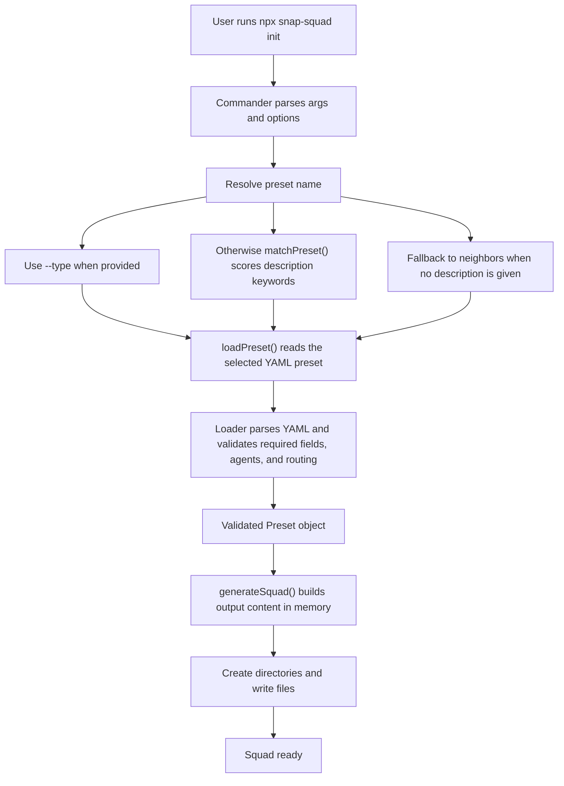
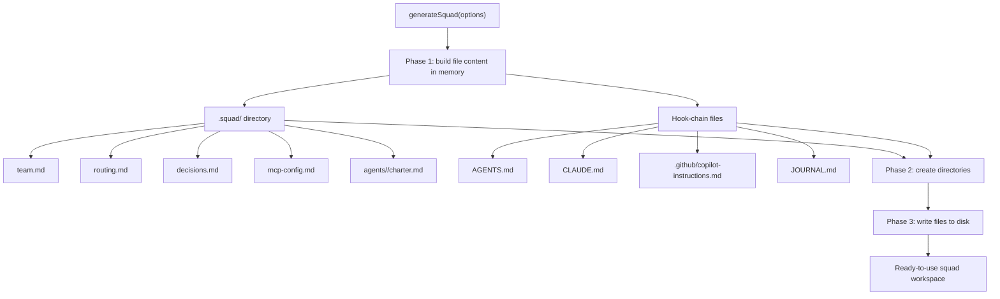
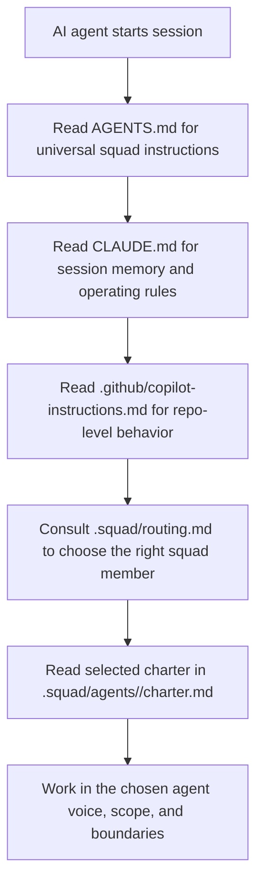
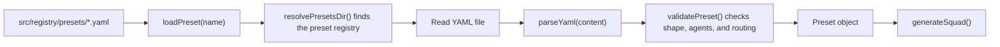

# Architecture

## Overview

snap-squad is a CLI that turns a plain-English project description or explicit preset choice into a ready-to-use Squad workspace. `init` resolves a preset, loads and validates its YAML definition, then generates the `.squad/` coordination files and root hook-chain files that make downstream AI agents squad-aware.

## CLI Flow



## File Generation Pipeline



## Hook Chain Mechanism



## Preset Architecture



## Directory Structure

```text
project-root/
├── .github/
│   └── copilot-instructions.md
├── .squad/
│   ├── agents/
│   │   └── <agent>/
│   │       └── charter.md
│   ├── decisions.md
│   ├── mcp-config.md
│   ├── routing.md
│   └── team.md
├── AGENTS.md
├── CLAUDE.md
└── JOURNAL.md
```
